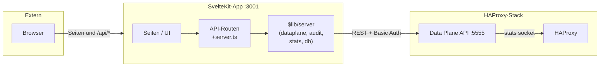

# SlateLink – HAProxy Management Web Interface

Web-Interface zur Verwaltung von HAProxy über die offizielle **HAProxy Data Plane API**. Unterstützt HTTP-, TCP- und UDP-Stream-Proxy, Client-IP-Weitergabe (X-Forwarded-For / PROXY protocol), Statistiken (Live + Historie) und Audit-Log.

## Architektur



- **HAProxy** (mit Data Plane API) – Reverse Proxy, Stats-Frontend auf Port 8404
- **App** (ein SvelteKit-Projekt, Node + adapter-node) – eine Anwendung: API unter `/api/*`, UI (Dashboard, Konfiguration, Audit-Log) unter `/`, Port 3001

## Voraussetzungen

- **HAProxy:** immer per Docker (Docker und Docker Compose)
- **App:** optional mit Docker oder lokal (Node.js 22+, **Bun** als Package Manager)

## Netzwerk-Konfiguration (macvlan)

Die Container nutzen **macvlan**, um eigene IPs im lokalen Netzwerk zu bekommen. **Vor dem ersten Start anpassen:**

1. **Netzwerk-Interface** in `docker-compose.yml` anpassen:
   ```yaml
   networks.slatelink-network.driver_opts.parent: eth0  # dein Interface (ip a oder ifconfig)
   ```

2. **Subnet, Gateway und IP-Bereich** für dein Netzwerk:
   ```yaml
   subnet: 192.168.1.0/24        # dein Netzwerk-Subnet
   gateway: 192.168.1.1          # dein Gateway/Router
   ip_range: 192.168.1.128/25    # IP-Bereich für Container (z.B. 192.168.1.128-255)
   ```

3. **Optional: Statische IPs** für Container festlegen (in docker-compose.yml auskommentiert):
   ```yaml
   networks:
     slatelink-network:
       ipv4_address: 192.168.1.130  # feste IP für HAProxy
   ```

**Wichtig:** Bei macvlan können Container vom Docker-Host nicht direkt erreicht werden (macvlan-Limitierung). Für Host → Container Kommunikation entweder:
- Einen Bridge-Container als Proxy verwenden
- Port-Mappings beibehalten (wie in docker-compose.yml)
- Über andere Netzwerk-Devices im Netzwerk zugreifen

## Betriebsarten

### 1. Alles mit Docker (Empfohlen für Production)

Startet HAProxy und SlateLink als Container im macvlan-Netzwerk:

```bash
docker compose up -d
```

- **HAProxy:** Über Port-Mapping oder eigene IP im Netzwerk
- **Data Plane API:** Port 5555 (Login **admin** / **adminpwd**)
- **SlateLink App:** http://localhost:3000 (Port-Mapping) oder über Container-IP

Die Container kommunizieren über das macvlan-Netzwerk `slatelink-network` und haben eigene IPs. Der SlateLink-Container nutzt `DATAPLANE_API_URL=http://haproxy:5555` automatisch (DNS-Auflösung über Container-Namen).

**Hinweis:** 
- Das lokale Verzeichnis `./haproxy` wird nach `/usr/local/etc/haproxy` im HAProxy-Container gemounted
- Standardmäßig wird das öffentliche Image `trackhe/slatelink:latest` von Docker Hub verwendet. Um das Image lokal zu bauen, kommentiere in `docker-compose.yml` die `image`-Zeile aus und aktiviere den `build`-Block.

### 2. Nur HAProxy in Docker, App lokal (Empfohlen für Entwicklung)

HAProxy läuft in Docker, die App auf deinem Rechner:

```bash
# Nur HAProxy starten (ohne SlateLink-Service)
docker compose up -d haproxy

# .env für lokale App erstellen (muss auf localhost zeigen)
# DATAPLANE_API_URL=http://localhost:5555
# DATAPLANE_API_USER=admin
# DATAPLANE_API_PASSWORD=adminpwd
bun install
bun run dev
```

- **HAProxy:** Port 80, Stats :8404
- **Data Plane API:** Port **5555** (Login **admin** / **adminpwd**)
- **App:** http://localhost:5173 (Vite dev) bzw. 3000 (Production: `bun start` oder `node build`)

**Anmeldung:** Die Data Plane API läuft in einem eigenen Container mit festem Login **admin** / **adminpwd** (Userlist in `haproxy/haproxy.cfg`).

### 3. App über HAProxy aufrufen (Statistiken im Dashboard)

Du kannst die App hinter HAProxy hängen und dann im **Dashboard** die Live-Statistiken sehen: Requests, Sessions, Bytes pro Frontend/Backend.

1. In `haproxy.cfg` ein Frontend (z. B. Port 80 oder 8080) so konfigurieren, dass es auf ein Backend mit der App zeigt:
   - Lokal: `server app 127.0.0.1:3000` oder `host.docker.internal:3000`
   - Docker-Netzwerk: `server app slatelink:3000`
2. Aufruf der App über HAProxy (z. B. http://localhost/ oder http://localhost:8080/).
3. Im **Dashboard** erscheint die Sektion **HAProxy-Statistiken (Live)** mit einer Tabelle: Typ (frontend/backend/server), Name, Requests, Sessions, Bytes in/out usw. So siehst du direkt, welches Frontend/Backend wie oft genutzt wird.

Die Daten kommen von der Data Plane API (`/v3/services/haproxy/stats/native`); die App fragt sie beim Laden der Startseite ab.

## Troubleshooting: „API: 502 – fetch failed“

Wenn die App **http://localhost:5555** nicht erreicht:

1. **HAProxy-Container läuft?**

   ```bash
   docker compose ps haproxy
   ```

   Sollte `Up` zeigen. Sonst: `docker compose up -d haproxy`.

2. **Data Plane API erreichbar?**

   ```bash
   curl -s -o /dev/null -w "%{http_code}" -u admin:adminpwd http://localhost:5555/v3/info
   ```

   - **200** = OK, dann liegt das Problem an der App (.env, Neustart).
   - **000** oder „Connection refused“ = Port 5555 nicht erreichbar: Container-Logs prüfen:
     ```bash
     docker compose logs haproxy --tail 80
     ```
     Wenn die Data Plane API im Container nicht startet (z. B. fehlender Socket), erscheinen Fehler dort.

3. **App lokal:** In `.env` oder `.env.local` muss stehen:
   - `DATAPLANE_API_URL=http://localhost:5555`
   - Nach Änderung an .env: App neu starten (`bun run dev`).

4. **Schnellprüfung:** `sh scripts/check-haproxy.sh` prüft Container und Erreichbarkeit von localhost:5555.

## API

| Endpoint                                                   | Beschreibung                                                |
| ---------------------------------------------------------- | ----------------------------------------------------------- |
| `GET /api/health`                                          | Health-Check                                                |
| `GET /api/info`                                            | Data Plane API Info                                         |
| `GET /api/frontends`                                       | Frontends (DPA)                                             |
| `GET /api/backends`                                        | Backends (DPA)                                              |
| `GET /api/stats`                                           | Live-Statistiken (HAProxy Stats)                            |
| `GET /api/stats/snapshot`                                  | Snapshot in DB schreiben                                    |
| `GET /api/stats/history`                                   | Historie aus SQLite (from, to, limit, offset)               |
| `GET /api/audit`                                           | Audit-Log (from, to, action, resource_type, limit, offset)  |
| `POST /api/config/backends`                                | Backend anlegen (name, servers[])                           |
| `PUT /api/config/backends/[name]`                          | Backend bearbeiten (z. B. mode)                             |
| `POST /api/config/backends/[name]/servers`                 | Server hinzufügen                                           |
| `DELETE /api/config/backends/[name]/servers/[server_name]` | Server entfernen                                            |
| `DELETE /api/config/backends/[name]`                       | Backend löschen (409 wenn ein Frontend darauf verweist)     |
| `POST /api/config/frontends`                               | Frontend anlegen (name, default_backend, bindPort, options) |
| `PUT /api/config/frontends/[name]`                         | Frontend bearbeiten (z. B. default_backend)                 |
| `POST /api/config/frontends/[name]/binds`                  | Bind hinzufügen (409 wenn Adresse:Port schon vergeben)      |
| `DELETE /api/config/frontends/[name]/binds/[bind_name]`    | Bind entfernen                                              |
| `DELETE /api/config/frontends/[name]`                      | Frontend löschen                                            |

## Tests

Tests laufen mit **Vitest** (`bun run test` bzw. `npm run test`). Getestet wird:

| Modul | Inhalt |
|-------|--------|
| **db** (`src/lib/server/db/index.test.ts`) | Schema-Erstellung, Audit-Log und Stats-Snapshots einfügen/lesen, Frontend-Rules CRUD, Fallback bei ungültigem JSON |
| **domain-mapping** | Mapping-Text aus Frontend-Rules bauen, Default-Zertifikat wenn keine Regel ein cert_ref hat |
| **sync-frontend-rules** | `syncOneFrontendRules`: ACLs, switching rules, Redirects erzeugen; `syncAllFrontendRules`: alle Frontends, Mapping schreiben |
| **rules-validation** | `parseRuleId` (gültige/ungültige IDs), `normalizeDomains` (Trimmen, leere Werte, Nicht-Arrays) |
| **bind-validation** (`src/lib/shared`) | Gültige Wildcard-/IP-Bind-Adressen, Ablehnung ungültiger Adressen, Fallback-Bind-Namen, gültige Custom-Namen |
| **dpa-utils** | `toArray` / `toDpaList`: Arrays, Wrapper-Payloads, ungültige Payloads |
| **dataplane** | `getInfo`, `getConfigurationVersion`, `getFrontends`/`getFrontend`, `getBackends`/`getBackend`, `frontendNamesUsingBackend`, `usedConfigNames`, `bindEndpointKey`, `getAllUsedBindEndpoints`, `deleteBind`, `deleteServer` (jeweils mit Mock-Fetch) |
| **stats** | `getStatsHistory` (leer, mit Snapshots, Limit), `deleteSnapshotsOlderThanDays` |
| **audit** | `logAction` (mit/ohne optionale Felder), `getAuditLog` (Sortierung, Filter nach action, limit) |

Es gibt keine End-to-End- oder UI-Tests; die Tests decken Server-Logik, DB, Data-Plane-API-Helfer und Validierung ab.

## Dokumentation

- **Dokumentations-Index:** [docs/README.md](docs/README.md) – Übersicht aller Docs.
- **Implementierungsstand:** [IMPLEMENTATION.md](IMPLEMENTATION.md) – implementierte Funktionen und nächste Schritte.
- **Architektur & Komponentendiagramme:** [docs/ARCHITEKTUR.md](docs/ARCHITEKTUR.md) – Server-Module, API, Datenfluss (Mermaid).
- **Module & Funktionen im Code:** [docs/KOMPONENTEN.md](docs/KOMPONENTEN.md) – Konkrete Code-Module (config, db, dataplane, sync, Zertifikate, Audit, Stats) und Zusammenarbeit.
- **Todo & Codequalität:** [docs/TODO.md](docs/TODO.md) – Fehlerquellen, Variablen ausschreiben, offene Punkte.

## Docker

**Öffentliches Image:** [trackhe/slatelink auf Docker Hub](https://hub.docker.com/r/trackhe/slatelink)

### Container starten (mit öffentlichem Image)

```bash
docker run -d \
  --name slatelink \
  -p 3000:3000 \
  -v slatelink-data:/data \
  -e DB_PATH=/data/slatelink.db \
  -e DATAPLANE_API_URL=http://your-haproxy-host:5555 \
  -e DATAPLANE_API_USER=admin \
  -e DATAPLANE_API_PASSWORD=adminpwd \
  trackhe/slatelink:latest
```

Dashboard: **http://localhost:3000**

Port anpassen (z. B. 8080):

```bash
docker run -d -p 8080:3000 -v slatelink-data:/data \
  -e DB_PATH=/data/slatelink.db \
  -e DATAPLANE_API_URL=http://your-haproxy-host:5555 \
  -e DATAPLANE_API_USER=admin \
  -e DATAPLANE_API_PASSWORD=adminpwd \
  trackhe/slatelink:latest
```

### Umgebungsvariablen

| Variable | Beschreibung | Standard |
|----------|--------------|----------|
| `PORT` | HTTP-Port | `3000` |
| `HOST` | Bind-Adresse (z. B. `0.0.0.0` für alle Interfaces) | `0.0.0.0` |
| `DB_PATH` | Pfad zur SQLite-Datenbank | `/data/slatelink.db` |
| `DATAPLANE_API_URL` | HAProxy Data Plane API URL | `http://dataplaneapi:5555` |
| `DATAPLANE_API_USER` | Data Plane API Benutzername | `admin` |
| `DATAPLANE_API_PASSWORD` | Data Plane API Passwort | `adminpwd` |
| `NODE_ENV` | Node-Umgebung | `production` |

### Plattformen

Image wird für **linux/amd64** und **linux/arm64** (z. B. Apple Silicon, Raspberry Pi) bereitgestellt.

### Image-Labels (OCI)

Das Image enthält folgende [OCI-Labels](https://github.com/opencontainers/image-spec/blob/main/annotations.md) (auf Docker Hub unter „Labels" sichtbar):

| Label | Beschreibung |
|-------|--------------|
| `org.opencontainers.image.source` | GitHub-Repository-URL |
| `org.opencontainers.image.revision` | Git-Commit (bei CI-Build) |
| `org.opencontainers.image.version` | Version/Tag (z. B. bei Release) |

### Image selbst bauen

**Nur für deine Architektur (z. B. Apple Silicon):**

```bash
docker build -t slatelink .
```

**Multi-Platform (ARM64 + AMD64) und Push zu Docker Hub:**

```bash
docker buildx build --platform linux/amd64,linux/arm64 \
  -t trackhe/slatelink:latest \
  --push .
```

### CI/CD (GitHub Actions)

Bei **Release-Tags** (z. B. `v1.0.0`) baut und pusht der Workflow [`.github/workflows/docker-publish.yml`](.github/workflows/docker-publish.yml) das Image automatisch für **linux/amd64** und **linux/arm64** nach Docker Hub.

**Voraussetzung:** In den GitHub-Repository-Einstellungen unter „Secrets and variables" → Actions die Secrets anlegen:

- `DOCKERHUB_USERNAME` – dein Docker-Hub-Benutzername (z. B. `trackhe`)
- `DOCKERHUB_TOKEN` – ein [Docker Hub Access Token](https://hub.docker.com/settings/security) (mit Lese-/Schreibrechten für das Repo)

Nach dem Anlegen eines Releases (z. B. Tag `v1.0.0` erstellen und optional „Publish release") wird das Image mit den Tags `latest` und `v1.0.0` gebaut und gepusht.

## Meilensteine (Git-Tags)

- `milestone/m1-infrastructure` – Docker Compose, HAProxy-Konfiguration

## Lizenz

Projekt-spezifisch.
