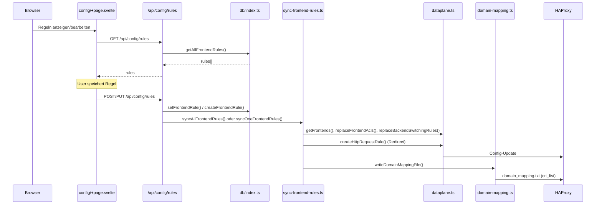
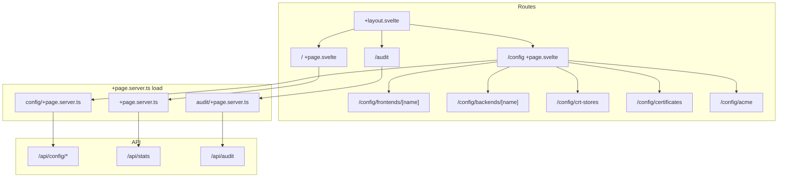
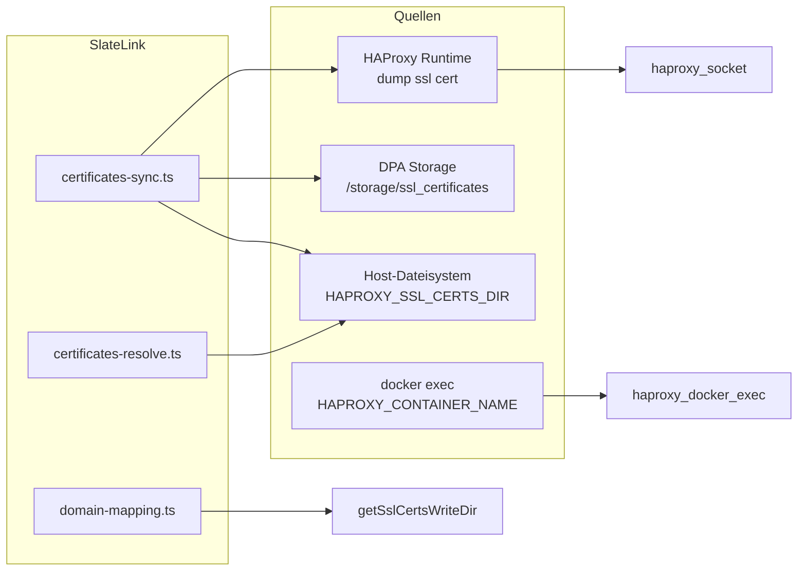

# SlateLink – Architektur und Komponentendiagramme

## 1. System-Übersicht

```mermaid
flowchart TB
  subgraph extern [Extern]
    User[Browser]
  end
  subgraph app [SvelteKit-App]
    UI[Seiten / UI<br/>+page.svelte, +layout.svelte]
    API["API-Routen<br/>/api/**/+server.ts"]
    Server["$lib/server"]
    UI -->|fetch| API
    API --> Server
  end
  subgraph haproxy [HAProxy-Stack]
    DPA[Data Plane API :5555]
    HAProxy[HAProxy :80/443/8404]
  end
  subgraph persist [Persistenz]
    DB[(SQLite<br/>app.db)]
    FS[Dateisystem<br/>haproxy/ssl, domain_mapping.txt]
  end
  User -->|"/" + "/api/*"| app
  Server -->|REST + Basic Auth| DPA
  Server --> DB
  Server --> FS
  DPA -->|stats socket / config| HAProxy
```

## 2. Server-Module ($lib/server)

```mermaid
flowchart LR
  subgraph config [Konfiguration]
    config[config.ts]
  end
  subgraph dpa [Data Plane API]
    dataplane[dataplane.ts]
  end
  subgraph db [Datenbank]
    schema[schema.ts]
    db_index[index.ts]
  end
  subgraph domain [Domain/Zertifikate]
    domain_mapping[domain-mapping.ts]
    cert_sync[certificates-sync.ts]
    cert_resolve[certificates-resolve.ts]
    haproxy_certs[haproxy-certs-dir.ts]
    haproxy_exec[haproxy-docker-exec.ts]
    haproxy_socket[haproxy-socket.ts]
    parse_cert[parse-cert.ts]
    default_crt[default-crt-store.ts]
  end
  subgraph sync [Regel-Sync]
    sync_rules[sync-frontend-rules.ts]
  end
  subgraph app_logic [App-Logik]
    audit[audit.ts]
    stats[stats.ts]
  end
  config --> dataplane
  config --> db_index
  config --> haproxy_certs
  config --> haproxy_exec
  config --> haproxy_socket
  schema --> db_index
  dataplane --> sync_rules
  db_index --> sync_rules
  db_index --> audit
  db_index --> stats
  domain_mapping --> sync_rules
  sync_rules --> domain_mapping
  cert_sync --> haproxy_certs
  cert_sync --> haproxy_exec
  cert_sync --> haproxy_socket
  cert_resolve --> parse_cert
  cert_resolve --> haproxy_certs
```

## 3. API-Routen (Übersicht)

```mermaid
flowchart TB
  subgraph health [Health & Info]
    GET_health[GET /api/health]
    GET_info[GET /api/info]
  end
  subgraph stats [Statistiken]
    GET_stats[GET /api/stats]
    GET_stats_snapshot[GET /api/stats/snapshot]
    GET_stats_history[GET /api/stats/history]
  end
  subgraph audit [Audit]
    GET_audit[GET /api/audit]
    GET_audit_log[GET /api/audit/haproxy-log]
  end
  subgraph config_api [Config API]
    frontends[Frontends CRUD + Binds]
    backends[Backends CRUD + Servers]
    rules[Rules CRUD]
    crt_stores[CrtStores CRUD + Loads]
    certs[Certificates, Storage, ACME]
    domain_mapping[domain-mapping/regenerate]
    default_ssl[default-ssl-cert]
  end
  GET_health --> config
  GET_info --> dataplane
  GET_stats --> dataplane
  GET_stats_snapshot --> stats
  GET_stats_history --> db
  GET_audit --> db
  GET_audit_log --> haproxy_exec
  frontends --> dataplane
  frontends --> db
  backends --> dataplane
  rules --> db
  rules --> sync_rules
  crt_stores --> dataplane
  certs --> cert_sync
  certs --> cert_resolve
  domain_mapping --> domain_mapping_module
  default_ssl --> dataplane
```



## 4. Datenfluss: Config-Seite → Regeln → HAProxy



## 5. UI-Seiten und Datenquellen



## 6. Zertifikats-Pfade (vereinfacht)



---

*Bei Änderungen an Modulen oder API-Routen diese Diagramme anpassen (siehe IMPLEMENTATION.md §5, PROGRESS.md).*
