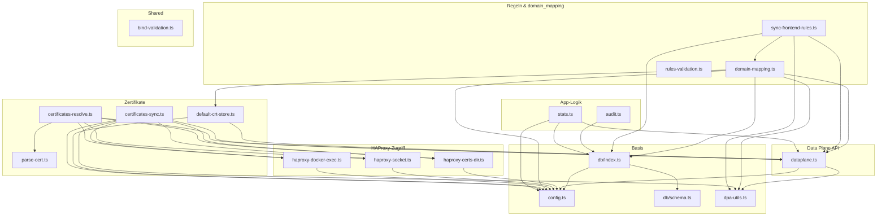
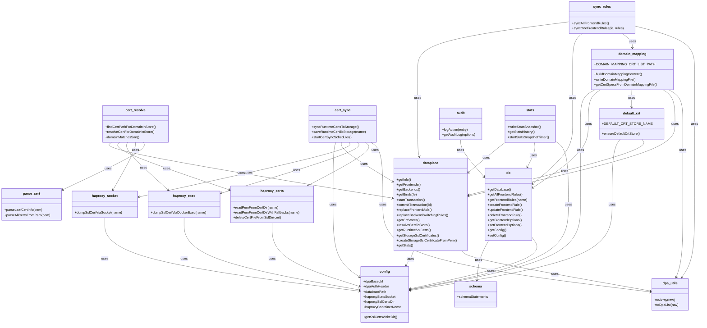
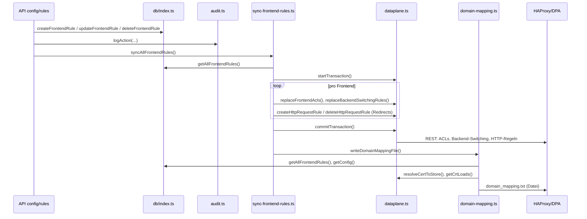
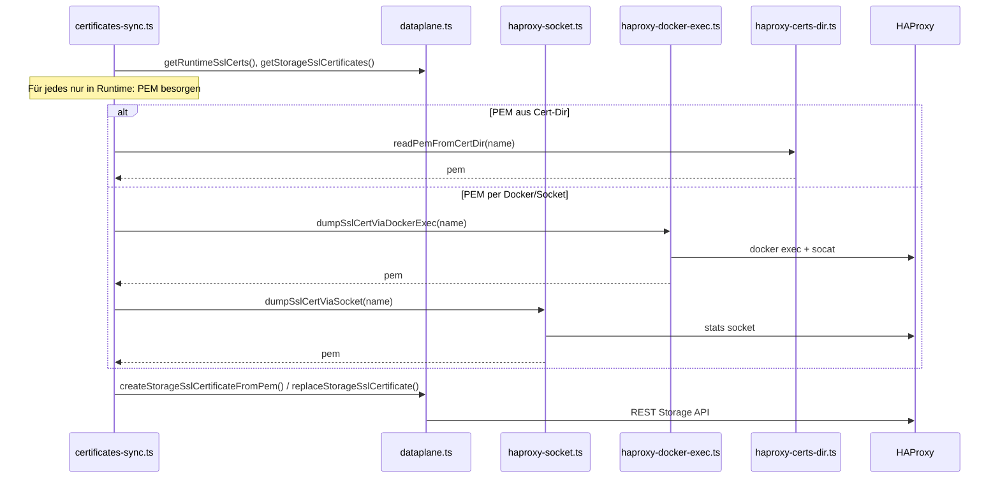
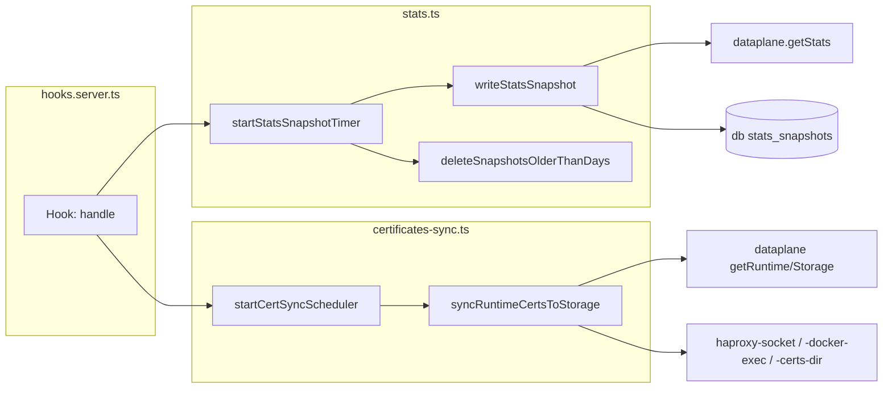

# SlateLink – Module und Funktionen im Code

Diese Datei beschreibt die **konkreten Code-Module** in `src/lib/server` und `src/lib/shared`: exportierte Funktionen/Konstanten und wie die Module zusammenarbeiten.

---

## Komponentendiagramme

### Modul-Abhängigkeiten (Import-Beziehungen)

Pfeil **A → B** bedeutet: Modul A importiert/verwendet Modul B.

*rules-validation* wird nur von API-Routen (config/rules) verwendet; *bind-validation* von API-Routen (frontends/binds). Sie sind bewusst nicht in die Grafik eingetragen, um die Linien übersichtlich zu halten.

---

### Modul-Struktur (Class-Diagramm)

Module als „Klassen“ mit ausgewählten Exporten; Pfeil **A → B** = A nutzt B. (Vollständige Export-Listen stehen in den Tabellen unten.)

---

### Ablauf: Regel anlegen/ändern/löschen

Wenn eine Regel über die API geändert wird (POST/PUT/DELETE `/api/config/rules`):

---

### Ablauf: Zertifikat-Sync (Runtime → Storage)

Periodisch oder manuell: Zertifikate, die nur in HAProxy-Runtime existieren, werden in den DPA-Storage übernommen.

---

### Ablauf: App-Start (Hooks)

Beim Start der SvelteKit-App werden zwei Hintergrund-Timer gestartet:

---

## 1. Konfiguration und Basis

### `$lib/server/config.ts`

Liest Umgebungsvariablen und stellt sie als Konstanten bereit. Wird von fast allen Server-Modulen genutzt.

| Export | Bedeutung |
|--------|-----------|
| `dpaBaseUrl`, `dpaAuthHeader` | Data Plane API Basis-URL und Basic-Auth-Header |
| `databasePath` | Pfad zur SQLite-Datei (z. B. `data/app.db`) |
| `statsSnapshotIntervalMs`, `statsRetentionDays` | Stats-Intervall und Aufbewahrungsdauer |
| `certSyncIntervalMs` | Intervall für Zertifikat-Sync (Runtime → Storage) |
| `haproxyStatsSocket` | Stats-Socket (Host, z. B. für `docker exec`) |
| `haproxySslCertsDir` | Host-Pfad zum SSL-Zertifikatsverzeichnis |
| `getSslCertsWriteDir()` | Schreibbares Verzeichnis für domain_mapping.txt (aus HAPROXY_SSL_CERTS_DIR) |
| `haproxyContainerName`, `haproxyStatsSocketInContainer` | Für `docker exec` (Zertifikat aus Container auslesen) |

**Wird genutzt von:** db, dataplane, stats, domain-mapping, default-crt-store, haproxy-certs-dir, haproxy-socket, haproxy-docker-exec, certificates-sync, API-Routen (domain-mapping/regenerate).

---

### `$lib/server/db/index.ts`

SQLite-Zugriff (better-sqlite3). Schema aus `db/schema.ts`.

| Export | Bedeutung |
|--------|-----------|
| `getDatabase()`, `closeDatabase()` | DB-Instanz öffnen/schließen |
| `getFrontendOptions(frontendName)`, `setFrontendOptions(...)` | Optionen pro Frontend (forwardClientIp, bindDomains, bindCertRef, …) |
| `setBindDomains`, `removeBindDomains`, `setBindCertRef`, `removeBindCertRef` | Domains und Zertifikatsreferenz pro Bind |
| `getAllFrontendRules()`, `getFrontendRules(feName)`, `getFrontendRuleById(id)` | Regeln lesen |
| `createFrontendRule`, `updateFrontendRule`, `deleteFrontendRule` | Regeln anlegen/ändern/löschen |
| `getConfig(key)`, `setConfig(key, value)` | Key-Value-Config (z. B. default_ssl_cert_crt_list) |
| `CONFIG_KEY_DEFAULT_SSL_CRT_LIST` | Key für Standard-Zertifikat |

**Wird genutzt von:** audit, stats, domain-mapping, sync-frontend-rules, alle API-Routen für Regeln/Frontends/Default-SSL.

---

### `$lib/server/db/schema.ts`

| Export | Bedeutung |
|--------|-----------|
| `schemaStatements` | Array von SQL-DDL-Statements (Tabellen: audit_log, stats_snapshots, frontend_options, frontend_rules, config) |

**Wird genutzt von:** nur `db/index.ts` beim Öffnen der DB.

---

### `$lib/server/dpa-utils.ts`

Hilfsfunktionen für die Antworten der Data Plane API (DPA liefert oft `{ data: [...] }` oder rohe Arrays).

| Export | Bedeutung |
|--------|-----------|
| `toArray(rawValue)` | Macht aus einem Wert ein Array (sonst `[]`) |
| `toDpaList(rawValue)` | Extrahiert `data`-Array aus DPA-Antwort oder gibt Array zurück |

**Wird genutzt von:** dataplane (intern), domain-mapping, sync-frontend-rules, certificates-sync, alle API-Routen die DPA-Antworten parsen.

---

## 2. Data Plane API – Kern

### `$lib/server/dataplane.ts`

Zentrale Anbindung an die HAProxy Data Plane API (REST, Basic Auth). Alle Aufrufe gehen über `fetch` an `dpaBaseUrl`.

- **Transaktionen:** `startTransaction()`, `commitTransaction(transactionId)`
- **Info/Version:** `getInfo()`, `getConfigurationVersion()`
- **Frontends:** `getFrontends()`, `getFrontend(name)`, `createFrontend`, `updateFrontend`, `deleteFrontend`
- **Backends:** `getBackends()`, `getBackend(name)`, `createBackend`, `updateBackend`, `deleteBackend`
- **Binds:** `getBinds(feName)`, `getBind`, `createBind`, `updateBind`, `deleteBind`; `bindEndpointKey`, `getAllUsedBindEndpoints`, `getSslCertificatesUsedInBinds`
- **HTTP-Regeln:** `getHttpRequestRules`, `createHttpRequestRule`, `deleteHttpRequestRule`, `syncRedirectHttpToHttps`
- **ACLs / Backend-Switching:** `getFrontendAcls`, `replaceFrontendAcls`, `getBackendSwitchingRules`, `replaceBackendSwitchingRules`
- **Server:** `getServers`, `getServer`, `createServer`, `updateServer`, `deleteServer`
- **Hilfen:** `frontendNamesUsingBackend`, `usedConfigNames`
- **Global/Defaults:** `getDefaults`, `getGlobal`, `updateGlobal`
- **ACME:** `getAcmeProviders`, `getAcmeProvider`, `createAcmeProvider`, `updateAcmeProvider`, `deleteAcmeProvider`, `getAcmeRuntimeStatus`, `triggerAcmeRenew`
- **CrtStores / CrtLoads:** `getCrtStores`, `getCrtStore`, `createCrtStore`, `updateCrtStore`, `deleteCrtStore`, `getCrtLoads`, `getCrtLoad`, `createCrtLoad`, `updateCrtLoad`, `deleteCrtLoad`, `resolveCertToStore`
- **Zertifikate (Runtime/Storage):** `getRuntimeSslCerts`, `getRuntimeSslCert`, `getStorageSslCertificates`, `getStorageSslCertificate`, `getStorageSslCertificateAsText`, `createStorageSslCertificateFromPem`, `createStorageSslCertificate`, `replaceStorageSslCertificate`, `deleteStorageSslCertificate`
- **Defaults (DPA):** `updateDefaults`
- **Stats:** `getStats(options?)`

**Importiert:** config (dpaBaseUrl, dpaAuthHeader), dpa-utils (toDpaList).

**Wird genutzt von:** sync-frontend-rules, domain-mapping, default-crt-store, certificates-sync, certificates-resolve, allen API-Routen die mit Frontends/Backends/Regeln/ACME/Stores/Zertifikaten arbeiten, stats (getStats), +page.server.ts (getInfo, getStats).

---

## 3. HAProxy – Socket, Docker, Dateisystem

### `$lib/server/haproxy-socket.ts`

| Export | Bedeutung |
|--------|-----------|
| `dumpSslCertViaSocket(name)` | Liest Zertifikat (PEM) über Stats-Socket aus (z. B. `show ssl cert`). Nutzt `haproxyStatsSocket` aus config. |

**Wird genutzt von:** certificates-sync, certificates-resolve, API certificates/[...name] (PEM anzeigen).

---

### `$lib/server/haproxy-docker-exec.ts`

| Export | Bedeutung |
|--------|-----------|
| `dumpSslCertViaDockerExec(name)` | Liest PEM über `docker exec` im HAProxy-Container (z. B. `echo "show ssl cert" \| socat`). Nutzt `haproxyContainerName`, `haproxyStatsSocketInContainer`. |

**Wird genutzt von:** certificates-sync, certificates-resolve, API certificates/[...name].

---

### `$lib/server/haproxy-certs-dir.ts`

Liest/schreibt Zertifikatsdateien im konfigurierten SSL-Verzeichnis (Host).

| Export | Bedeutung |
|--------|-----------|
| `readPemFromCertDir(name)` | Liest eine PEM-Datei aus dem Verzeichnis. |
| `readPemFromCertDirWithFallbacks(name)` | Versucht Cert-Dir, dann Docker-Exec, dann Socket. |
| `deleteCertFileFromSslDir(certificate)` | Löscht eine Zertifikatsdatei im SSL-Verzeichnis. |

**Importiert:** config (haproxySslCertsDir).

**Wird genutzt von:** certificates-sync, certificates-resolve, API certificates, API crt-stores/[name]/loads/[certificate] (CrtLoad löschen + Datei), API storage/ssl-certificates/[name] (Storage-Zertifikat löschen).

---

## 4. Zertifikate – Parsen, Auflösen, Sync

### `$lib/server/parse-cert.ts`

| Export | Bedeutung |
|--------|-----------|
| `parseLeafCertInfo(pem)` | Parst das erste Zertifikat aus PEM (Subject, Issuer, notAfter, …). |
| `parseAllCertsFromPem(pem)` | Parst alle Zertifikate aus einer PEM-Kette. |

**Wird genutzt von:** certificates-resolve, API certificates/[...name] (Detail-Anzeige).

---

### `$lib/server/certificates-resolve.ts`

Findet für eine Domain das passende Zertifikat in einem Store (SAN/Domains-Liste) oder löst ACME aus.

| Export | Bedeutung |
|--------|-----------|
| `domainMatchesSan(domain, sanString)` | Prüft, ob Domain zum SAN-String passt. |
| `domainMatchesDomainsList(domain, domains)` | Prüft, ob Domain in der Domains-Liste vorkommt. |
| `findCertPathForDomainInStore`, `findCertPathForDomainsInStore` | Sucht Zertifikat in einem CrtStore für Domain(s). |
| `resolveCertForDomainInStore`, `resolveCertForDomainsInStore` | Wie findCertPath, plus optional ACME-Anforderung. |

**Importiert:** dataplane (getCrtStore, getCrtLoads, createCrtLoad, getAcmeProviders, triggerAcmeRenew, getStorageSslCertificateAsText), haproxy-certs-dir, haproxy-docker-exec, haproxy-socket, parse-cert.

**Wird genutzt von:** API-Routen die Zertifikate für Domains auflösen müssen (z. B. Regel-Editor).

---

### `$lib/server/certificates-sync.ts`

Synchronisiert Zertifikate von „nur in Runtime“ nach Storage (DPA-Storage), damit sie nach Neustart von Disk geladen werden.

| Export | Bedeutung |
|--------|-----------|
| `syncRuntimeCertsToStorage()` | Vergleicht Runtime- mit Storage-Liste; fehlende werden per PEM (Socket/Exec/CertDir) geholt und per DPA angelegt/ersetzt. |
| `saveRuntimeCertToStorage(name)`, `saveRuntimeCertToStorageAs(name, targetName)` | Einzelnes Zertifikat nach Storage speichern. |
| `startCertSyncScheduler()` | Startet einen Timer (certSyncIntervalMs), der periodisch syncRuntimeCertsToStorage aufruft. |

**Importiert:** dataplane (getRuntimeSslCerts, getStorageSslCertificates, createStorageSslCertificateFromPem, replaceStorageSslCertificate), haproxy-socket, haproxy-docker-exec, haproxy-certs-dir, config, dpa-utils.

**Wird genutzt von:** hooks.server.ts (startCertSyncScheduler), API config/certificates/sync-from-runtime (manueller Sync).

---

### `$lib/server/default-crt-store.ts`

Stellt den eingebauten HAProxy-Standard-Zertifikats-Store (default / default.pem) sicher.

| Export | Bedeutung |
|--------|-----------|
| `DEFAULT_CRT_STORE_NAME`, `DEFAULT_CRT_FILENAME` | Konstanten `'default'`, `'default.pem'`. |
| `ensureDefaultCrtStore()` | Legt den default-Store und ggf. default.pem in der DPA an, falls nicht vorhanden. |

**Importiert:** config (getSslCertsWriteDir), dataplane (getCrtStores, getCrtStore, createCrtStore, getCrtLoads, createCrtLoad, getStorageSslCertificateAsText, createStorageSslCertificateFromPem).

**Wird genutzt von:** crt-stores/+page.server.ts (beim Laden der Seite).

---

## 5. Regeln und domain_mapping.txt

### `$lib/server/domain-mapping.ts`

Baut die Datei `domain_mapping.txt` (crt_list für HAProxy) aus den Frontend-Regeln und optional „pending“-Einträgen.

| Export | Bedeutung |
|--------|-----------|
| `DOMAIN_MAPPING_CRT_LIST_PATH` | Pfad, wie HAProxy die Datei kennt (z. B. `/usr/local/etc/haproxy/ssl/domain_mapping.txt`). |
| `buildDomainMappingContent(pending?)` | Erzeugt den Dateiinhalt aus DB-Regeln + optionalen Pending-Einträgen; löst path→store auf. |
| `writeDomainMappingFile()` | Schreibt den Inhalt in das Verzeichnis von getSslCertsWriteDir(). |
| `getCertSpecsFromDomainMappingFile()` | Liest die Datei und gibt die vorkommenden Zertifikat-Specs zurück (für UI/Validierung). |

**Importiert:** config (getSslCertsWriteDir), db (getAllFrontendRules, getConfig, CONFIG_KEY_DEFAULT_SSL_CRT_LIST), default-crt-store (DEFAULT_CRT_STORE_NAME, DEFAULT_CRT_FILENAME), dataplane (resolveCertToStore, getCrtLoads), dpa-utils (toDpaList).

**Wird genutzt von:** sync-frontend-rules (nach Sync), API config/rules (nach Anlegen/Ändern/Löschen), API frontends/[name]/binds (Bind anlegen), API frontends/[name]/binds/[bind_name] (Bind löschen), API domain-mapping/regenerate, crt-stores/+page.server.ts (getCertSpecsFromDomainMappingFile).

---

### `$lib/server/sync-frontend-rules.ts`

Synchronisiert die in der DB gespeicherten Frontend-Regeln in die HAProxy-Config: ACLs, Backend-Switching, HTTP→HTTPS-Redirects, und schreibt domain_mapping.txt.

| Export | Bedeutung |
|--------|-----------|
| `syncAllFrontendRules()` | Holt alle Regeln aus der DB, gruppiert nach Frontend; ruft für jedes Frontend syncOneFrontendRules auf; schreibt am Ende writeDomainMappingFile(). |
| `syncOneFrontendRules(frontendName, rules)` | Setzt in einer DPA-Transaktion: ACLs (hdr(host)), Backend-Switching-Regeln, HTTP-Request-Redirect-Regeln für das Frontend. |

**Importiert:** dataplane (getFrontends, getHttpRequestRules, createHttpRequestRule, deleteHttpRequestRule, replaceFrontendAcls, replaceBackendSwitchingRules, startTransaction, commitTransaction), db (getAllFrontendRules), domain-mapping (writeDomainMappingFile), dpa-utils (toDpaList).

**Wird genutzt von:** API config/rules (GET/POST/PUT/DELETE – nach jeder Änderung syncAllFrontendRules).

---

### `$lib/server/rules-validation.ts`

Validierung und Normalisierung von Regel-Daten (IDs, Domains).

| Export | Bedeutung |
|--------|-----------|
| `parseRuleId(ruleIdParam)` | Parst Regel-ID aus String (positive Ganzzahl oder null). |
| `normalizeDomains(rawDomains)` | Macht aus einem Wert ein getrimmtes String-Array ohne leere Einträge. |

**Wird genutzt von:** API config/rules (Validierung von Request-Daten).

---

## 6. Audit und Stats

### `$lib/server/audit.ts`

Audit-Log in der SQLite-DB.

| Export | Bedeutung |
|--------|-----------|
| `logAction(entry)` | Schreibt einen Eintrag (action, resource_type, resource_id, details) in audit_log. |
| `getAuditLog(options)` | Liest Einträge mit optionalen Filtern (action, from, to, limit, offset), sortiert nach created_at desc. |

**Importiert:** db (getDatabase, AuditLogRow).

**Wird genutzt von:** allen API-Routen die Änderungen vornehmen (Frontends, Backends, Regeln, Stores, Zertifikate, ACME, …).

---

### `$lib/server/stats.ts`

Live-Stats von der DPA und Historie in der DB.

| Export | Bedeutung |
|--------|-----------|
| `writeStatsSnapshot()` | Holt getStats() von der DPA, speichert Payload in stats_snapshots. |
| `deleteSnapshotsOlderThanDays(days)` | Löscht alte Snapshots. |
| `getStatsHistory(from, to, limit, offset)` | Liest Snapshots aus der DB. |
| `startStatsSnapshotTimer()` | Startet periodischen Timer (statsSnapshotIntervalMs) für writeStatsSnapshot und Aufräumen. |

**Importiert:** dataplane (getStats), db (getDatabase, StatsSnapshotRow), config (statsSnapshotIntervalMs, statsRetentionDays).

**Wird genutzt von:** hooks.server.ts (startStatsSnapshotTimer), API stats/snapshot, API stats/history.

---

## 7. Shared (Frontend + Server)

### `$lib/shared/bind-validation.ts`

Validierung von Bind-Adressen und -Namen (wird in UI und ggf. API genutzt).

| Export | Bedeutung |
|--------|-----------|
| `isValidBindAddress(inputValue)` | Prüft, ob Wert eine gültige Bind-Adresse ist (Wildcard, IP, …). |
| `getSafeBindName(inputName, port)` | Liefert einen sicheren Bind-Namen (für HAProxy), falls der übergebene Name ungültig ist. |

**Wird genutzt von:** API-Routen die Binds anlegen (z. B. frontends/[name]/binds).

---

## 8. Typische Abläufe (Zusammenarbeit)

- **Regel anlegen/ändern/löschen (API config/rules):**  
  DB (createFrontendRule/updateFrontendRule/deleteFrontendRule) → sync-frontend-rules (syncAllFrontendRules) → dataplane (Transaktion, ACLs, Backend-Switching, Redirects) + domain-mapping (writeDomainMappingFile). Audit (logAction) wird von der API-Route aufgerufen.

- **Bind anlegen (API frontends/[name]/binds):**  
  dataplane (createBind, getAllUsedBindEndpoints, bindEndpointKey) → db (setFrontendOptions für Domains/CertRef) → domain-mapping (writeDomainMappingFile). Audit (logAction).

- **Zertifikat aus Runtime in Storage speichern:**  
  certificates-sync (syncRuntimeCertsToStorage oder saveRuntimeCertToStorage). Liest PEM über haproxy-socket / haproxy-docker-exec / haproxy-certs-dir, schreibt über dataplane (createStorageSslCertificateFromPem / replaceStorageSslCertificate).

- **Config-Seite laden:**  
  +page.server.ts lädt dataplane (getFrontends, getBackends, getCrtStores, …), db (getAllFrontendRules, getConfig), dpa-utils (toArray, toDpaList). Kein sync, nur Lesen.

- **App-Start (hooks.server.ts):**  
  stats (startStatsSnapshotTimer), certificates-sync (startCertSyncScheduler) – beide laufen im Hintergrund.

---

## 9. API-Routen → Module (Kurzüberblick)

| Bereich | Wichtige Module |
|---------|------------------|
| /api/health, /api/info | dataplane (getInfo) |
| /api/stats, /api/stats/snapshot, /api/stats/history | dataplane (getStats), stats (writeStatsSnapshot, getStatsHistory) |
| /api/audit | audit (getAuditLog) |
| /api/config/backends, /api/config/backends/[name], servers | dataplane, audit, dpa-utils |
| /api/config/frontends, /api/config/frontends/[name], binds | dataplane, audit, db (getFrontendOptions, setFrontendOptions), domain-mapping (writeDomainMappingFile), dpa-utils |
| /api/config/rules | db (getAllFrontendRules, createFrontendRule, …), sync-frontend-rules (syncAllFrontendRules), dataplane (getCrtLoads, resolveCertToStore), audit, dpa-utils, rules-validation |
| /api/config/default-ssl-cert | db (getConfig, setConfig) |
| /api/config/domain-mapping/regenerate | domain-mapping (writeDomainMappingFile), config (haproxySslCertsDir) |
| /api/config/crt-stores, loads, [certificate] | dataplane, audit, default-crt-store, haproxy-certs-dir, domain-mapping (getCertSpecsFromDomainMappingFile), dpa-utils |
| /api/config/storage/ssl-certificates | dataplane, audit, haproxy-certs-dir, dpa-utils |
| /api/config/certificates, sync-from-runtime | dataplane, haproxy-socket, haproxy-certs-dir, parse-cert, certificates-sync |
| /api/config/acme | dataplane, audit, dpa-utils |

Diese Tabelle zeigt nur die **Haupt-Module** pro Bereich; viele Routen nutzen zusätzlich `logAction` (audit) und `toArray`/`toDpaList` (dpa-utils).
